# EGaDS! Super Simple OpenGL Starter Kit

Hey everyone! This is going to be a very simple way of setting up a basic 3D application using **C++** and **OpenGL**. This should give you a quick start in basic computer graphics concepts and allow you to start making cool games/projects using these concepts!

# Installation & Setup

In this step we're going to set up the project so we can start working.

Start by cloning this repository using the below command and follow the instructions below!

```
git clone https://github.com/texas-egads/EGaDS-OpenGL-StarterKit.git
```
> **Note:** Support for **Mac** builds is coming soon, for now it is not supported.

## For Linux
Make sure your system has the **necessary drivers** for your graphics card. The installation instructions for those depend on your distribution. Also make sure you have a **C/C++ compiler**. You can verify this by doing a check to see if you can see the compiler information.
```
g++ --version
```
Next you want to install some **dependencies** on your system, use the below commands to install those third-party libraries!
```
sudo apt update
sudo apt install -y build-essential cmake mesa-common-dev mesa-utils freeglut3-dev libassimp-dev
```
Now navigate to the local repository's main project folder and run these commands to **build** and **run** the project.
```
  mkdir build
  cd build
  cmake ..
  make
  ./EGaDS-OpenGL-StarterKit
```
The last command should do nothing since the `main.cpp` file in the template just returns `0`. So you are good to go!

## For Windows
**Install Visual Studio**: If you haven't already, download and install Visual Studio from the [official website](https://visualstudio.microsoft.com/).

**Install CMake support**: During the installation of Visual Studio, make sure to select the workload "Desktop development with C++", which includes CMake support. If you've already installed Visual Studio without this workload, you can modify your installation by running the Visual Studio Installer again and adding the workload.

**Open your project folder in Visual Studio**: Open Visual Studio and either create a new project or open an existing one where your CMakeLists.txt file resides. You can do this by selecting "Open a project or solution" from the Visual Studio start page or by going to the "File" menu and choosing "Open" > "Folder...".

**Configure your build target**: At the top, specify the configuration you want to build (e.g., Debug or Release) and the architecture (e.g., x64 or x86). x86 should be selected with the current project files due to the precompiled binaries. This is to remain compatible with older devices. If you want to target x64 architectures, it is recommended to replace these binaries with their x64 counterparts.

**Build your project**: After configuring CMake settings, you can build your project by going to the "Build" menu and selecting "Build All" (or pressing `Ctrl+Shift+B`). Visual Studio will generate the build files using CMake and build your project according to the specified settings.

**Run and debug your project**: Once the build is complete, you can run and debug your project directly from Visual Studio using the built-in debugger. Set breakpoints in your code, choose the desired startup configuration (e.g., executable), and start debugging by pressing `F5` or clicking the "Start Debugging" button.

<p align="center">
  
</p>

# Creating a Window

Now that we have our project ready to go, let's start by creating a window. For that, we will be using the **GLFW** library.

## Setting up GLFW
We can start by including **GLFW** and **GLAD** at the top of our `main.cpp` file, and let's include **iostream** as well!
```cpp
#include <iostream>
#include "glad/glad.h"
#include "GLFW/glfw3.h"
```
For those unfamiliar with C++ include formatting, 
- `#include <filename>` makes the preprocessor search in an implementation-defined manner, normally in directories predefined by the compiler. It's usually used for items that are in the standard library and other header files associated with the target platform. 
- `#include "filename"` also makes the preprocessor search in an implementation-defined manner, but it is normally used to include our own header files and third-party libraries. Which in this case, is **GLFW**

Once that's settled, the next thing we need to do is initialize **GLFW** so we can properly use its functionality! 
```cpp
glfwInit();
```
So how **GLFW** works is it creates an **OpenGL** context, but we need to provide it with some information. This done using **Window Hints**. Let's give it some!
```cpp
glfwWindowHint(GLFW_CONTEXT_VERSION_MAJOR, 3);
glfwWindowHint(GLFW_CONTEXT_VERSION_MINOR, 3);
glfwWindowHint(GLFW_OPENGL_PROFILE, GLFW_OPENGL_CORE_PROFILE);
```
What we are doing here is providing the version of our **GLFW** context and specifying our **OpenGL** context. From here let's create a **GLFWwindow** pointer for our window!
```cpp
GLFWwindow* window = glfwCreateWindow(800, 800, "EGaDS OpenGL Starter Kit", NULL, NULL);
```
`glfwCreateWindow()` Takes in several parameters that define your typical application window. You might be familiar with some of these settings in your everyday use of desktop applications!
- **Width**: This specifies the width of the window in pixels.

- **Height**: This specifies the height of the window in pixels.

- **Title**: This specifies the title of the window, displayed in its title bar.

- **Monitor**: This specifies the monitor to use for full-screen mode. You can pass a pointer to the desired monitor. If you are creating a windowed mode window, pass `NULL`.

- **Share**: This specifies the context to share resources with. You can pass the context of another window if you are sharing resources. For our purposes, this isn't important, so we pass `NULL`.

After this, we can add a bit of error logging and just print a little message to tell us if something goes wrong when creating the window. If that does happen, we can terminate **GLFW**.
```cpp
if (window == NULL) {
	std::cout << "Error creating window" << std::endl;
	glfwTerminate();
}
```

Now, in order to actually use the window we just created, we can use `glfwMakeContextCurrent()` and pass in our **GLFWwindow** pointer. This introduces the window object to the current context in **OpenGL**.
```cpp
glfwMakeContextCurrent(window);
```

Then at the end of our application, we can destroy our window and terminate **GLFW**. This just cleans things up!
```cpp
glfwDestroyWindow(window);
glfwTerminate();
```
Now your `main.cpp` file should look something like this!
```cpp
#include <iostream>
#include "glad/glad.h"
#include "GLFW/glfw3.h"

int main(void) {
	glfwInit();

	glfwWindowHint(GLFW_CONTEXT_VERSION_MAJOR, 3);
	glfwWindowHint(GLFW_CONTEXT_VERSION_MINOR, 3);
	glfwWindowHint(GLFW_OPENGL_PROFILE, GLFW_OPENGL_CORE_PROFILE);

	GLFWwindow* window = glfwCreateWindow(800, 800, "EGaDS OpenGL Starter Kit", NULL, NULL);
	if (window == NULL) {
		std::cout << "Error creating window" << std::endl;
		glfwTerminate();
	}
	
	glfwMakeContextCurrent(window);

	glfwDestroyWindow(window);
	glfwTerminate();
	return 0;
}
```

Let's run our first window! If you have really good eyes, you might notice a window pop up for just a fraction of a second and immediately disappear! This is expected, so don't worry!

<p align="center">
  
</p>

The reason this happens is that as soon as the window is created, we destroy it and terminate the program. This is why we will need a loop to keep our window open and running!

## Keeping the Window Open and Running

So let's fix that! We can add a little while loop at the end of our setup that will check if the window should close, and poll for any additional events triggered by the user.
```cpp
while (!glfwWindowShouldClose(window)) {
    glfwPollEvents();
}
```
<p align="center">
  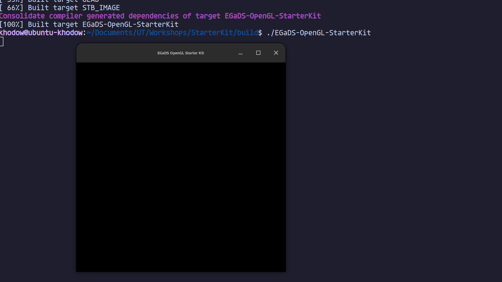
</p>

Now this window is a little boring, so let's apply a bit of color to it! First, let's load the **OpenGL** context and set up our **OpenGL** viewport to match the size of the **GLFW** window. In this case, that is `800` by `800`!
```cpp
gladLoadGL();
glViewport(0, 0, 800, 800);
```
Then we can define the **OpenGL** clear color. This is the color used to clear the screen when we clear the buffer bit. I'm going to choose some random rgb values, but feel free to pick whatever color you enjoy!
```cpp
glClearColor(0.07f, 0.28f, 0.55f, 1.0f);
```
Now that we set the color, we can clear the **OpenGL** color buffer. This is the call that clears our window with our specified color!
```cpp
glClear(GL_COLOR_BUFFER_BIT);
```

Lastly, we need to instruct **OpenGL** to swap the front and back buffers, and to understand this we need to talk a bit about how our graphics are rendered to the screen!

So how screens display our game is it renders images really fast to give us the illusion of motion. These images are called frames and are constantly being drawn.

<p align="center">
  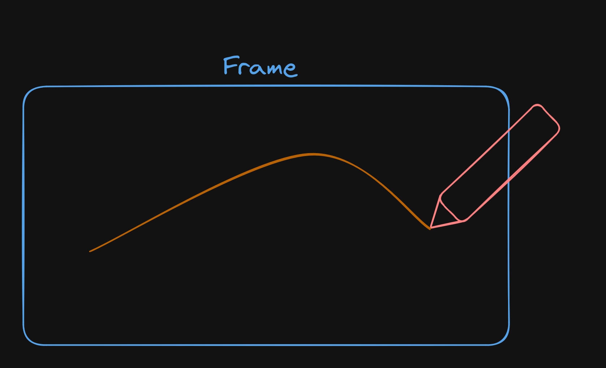
</p>

While loading the pixels from the current frame to the screen, the next frame is being drawn in the background and being prepared to load to the screen as the next frame. These frames are stored in things called buffers. As you can see below, the back buffer is drawing the next frame while the front buffer is displaying the current frame on the window.

<p align="center">
  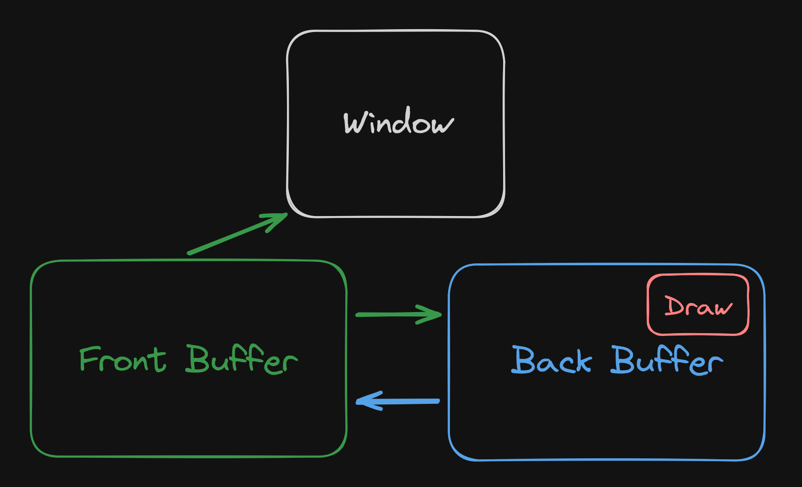
</p>

A while later, a swap buffer call is made and the 2 buffers switch jobs and now the formerly back buffer becomes the front buffer, and vice versa. The previous frame is now being overwritten with new information to prepare for the following frame. This process is constantly repeated and is called **buffer swapping**.

<p align="center">
  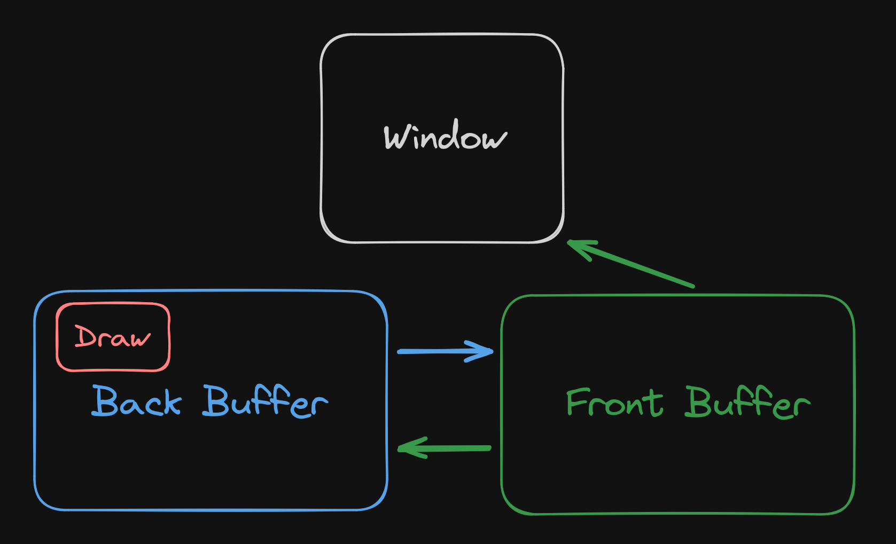
</p>

So let's implement this buffer swapping in our **C++** application! **OpenGL** actually makes this really simple!
```cpp
glfwSwapBuffers(window);
```

Our resulting `main.cpp` file should now look like this!
```cpp
#include<iostream>
#include<GLFW/glfw3.h>

int main(void) {
	glfwInit();

	glfwWindowHint(GLFW_CONTEXT_VERSION_MAJOR, 3);
	glfwWindowHint(GLFW_CONTEXT_VERSION_MINOR, 3);
	glfwWindowHint(GLFW_OPENGL_PROFILE, GLFW_OPENGL_CORE_PROFILE);

	GLFWwindow* window = glfwCreateWindow(800, 800, "EGaDS OpenGL Starter Kit", NULL, NULL);
	if (window == NULL) {
		std::cout << "Error creating window" << std::endl;
		glfwTerminate();
	}
	
	glfwMakeContextCurrent(window);

	gladLoadGL();
	glViewport(0, 0, 800, 800);
	glClearColor(0.07f, 0.28f, 0.55f, 1.0f);
	glClear(GL_COLOR_BUFFER_BIT);
	glfwSwapBuffers(window);
	
	while (!glfwWindowShouldClose(window)) {
		glfwPollEvents();
	}
	
	glfwDestroyWindow(window);
	glfwTerminate();
	return 0;
}
```

Awesome! Now if we compile and run this with **CMake**, we should have a nicely-colored window!

<p align="center">
  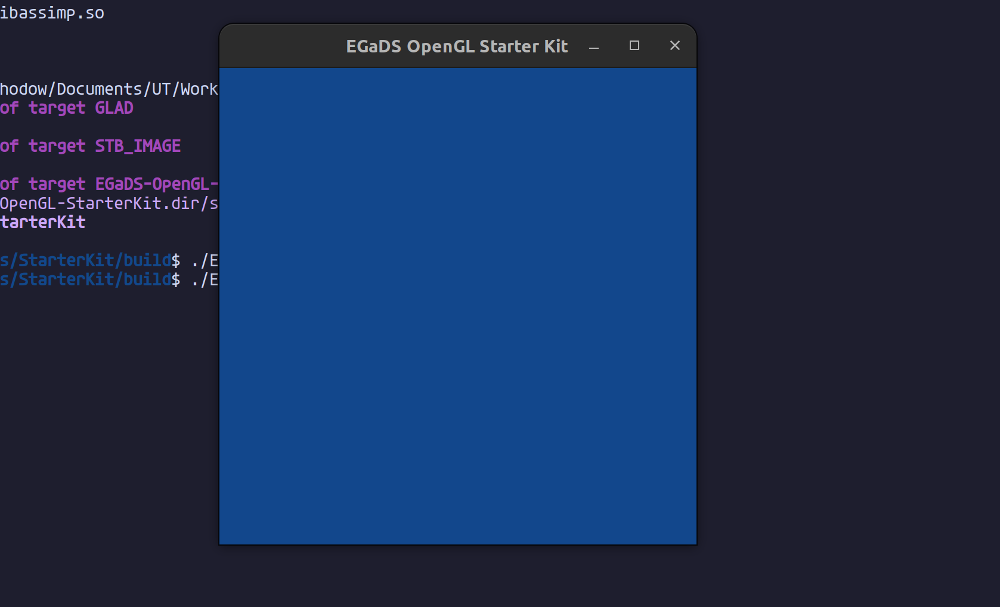
</p>

# Drawing a Triangle

Now let's add a triangle to our window! But first let's go over some graphics pipeline concepts in **OpenGL**!

## Graphics Pipeline

So the **OpenGL** graphics pipeline consists of several steps that essentially takes in a bunch of data and turns it into a final output frame that our window can display! The data is formatted as an array of vertices. However, these vertices are not necessarily just points, they can contain position data, color data, or texture coordinates, etc. 

The first phase of the graphics pipeline is the **vertex shader**. This takes the positions of all the vertices and transforms them, giving you inidividual points.

<p align="center">
  
</p>

This position data is then passed to the **shape assembler**, which will take those points and connect them based on the primitive type. A triangle primitive shape assembler would connect 3 points to form a trangle.

<p align="center">
  
</p>

Next, we have the **geometry shader**, which can add vertices and create new primitives out of existing primitives. Don't worry, this isn't really important for now!

<p align="center">
  
</p>

After our core geometry is laid out, we can enter the **rasterization** step. This turns our neat geometry into a series of pixels that approximates our shape. (Excuse my poor drawing, it's harder than it looks!) As you can see in the diagram below, the boxes represent a pixelated version of the triangle from earlier.

<p align="center">
  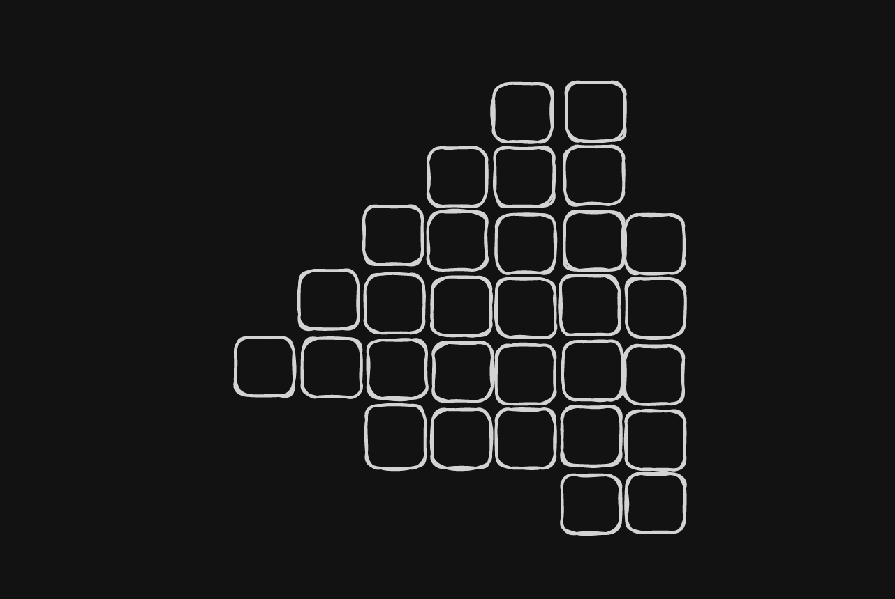
</p>

Finally, our shape enters the **fragment shader** process. The rasterized triangle from earlier does not contain any color information. This step maps colors to the pixels either by using color information or by using texture information from texture coordinates.

<p align="center">
  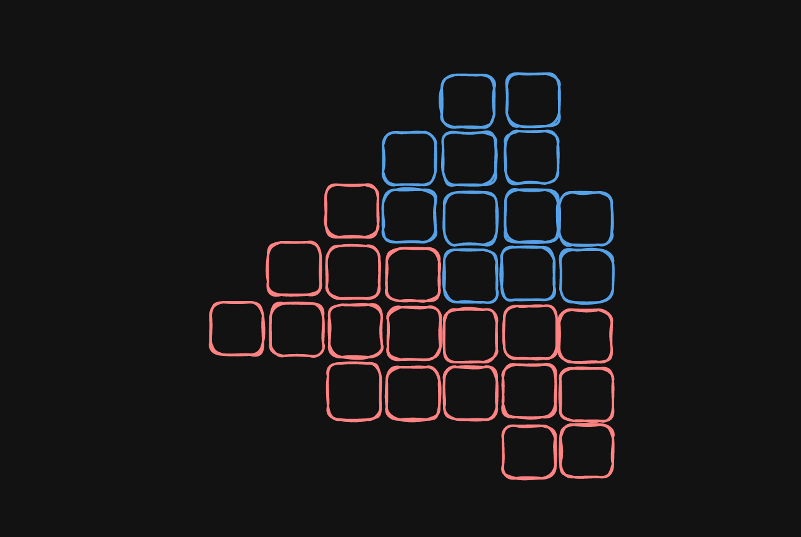
</p>

## Shader Source Code

We will cover shaders and how they work shortly, but for now we will just use a default vertex and fragment shader and store them as `char` pointers.

```cpp
const char* vertexShaderSource = "#version 330 core\n"
"layout (location = 0) in vec3 aPos;\n"
"void main()\n"
"{\n"
"   gl_Position = vec4(aPos.x, aPos.y, aPos.z, 1.0);\n"
"}\0";

const char* fragmentShaderSource = "#version 330 core\n"
"out vec4 FragColor;\n"
"void main()\n"
"{\n"
"   FragColor = vec4(0.8f, 0.65f, 0.97f, 1.0f);\n"
"}\n\0";
```

## Setting up Vertices

Now what we can do is set up an array of `GLfloats` this is **OpenGL**'s data type for floats when data loading. Here we have a set of 3 points that make up a triangle in 2D space. Note that the coordinate system is normalized, so `(0, 0)` is at the bottom left of the viewport and `(1, 1)` is at the top right. These coordinates show an equilateral triangle in the middle of the screen, hence the more complicated calculations. Feel free to choose any set of points for your triangle, however!
```cpp
GLfloat vertices[] = {
	-0.5f, -0.5f * float(sqrt(3)) / 3, 0.0f,
	0.5f, -0.5f * float(sqrt(3)) / 3, 0.0f,
	0.0f, 0.5f * float(sqrt(3)) * 2 / 3, 0.0f 	
};
```

## Loading Shaders

At the moment we do have the shader sources, but we don't exactly have shader objects. This makes them essentially useless. Therefore, we need to access, load, and compile them by reference in order to use them and render our triangle!

We can first use `glCreateShader()` and specify that it is a vertex shader using the `GL_VERTEX_SHADER` flag. We can store this in a `GLuint`, which is **OpenGL**'s version of an unsigned integer.

We can then provide the shader with a reference to our source `char` pointer and specify that we are only giving it 1 string.

One problem, the GPU can't understand the shader from source, so we should compile this shader right now so we can use it later. Luckily **OpenGL** provides the `glCompileShader` function so we can do this easily!

```cpp
GLuint vertexShader = glCreateShader(GL_VERTEX_SHADER);
glShaderSource(vertexShader, 1, &vertexShaderSource, NULL);
glCompileShader(vertexShader);
```

We can then repeat this for our fragment shader as well!
``` cpp
GLuint fragmentShader = glCreateShader(GL_FRAGMENT_SHADER);
glShaderSource(fragmentShader, 1, &fragmentShaderSource, NULL);
glCompileShader(fragmentShader);
```

So now, in order to actually use these shaders we have to wrap them up in what is called a **shader programs**. We can store this in a `GLuint` and call `glCreateProgram`. Aftwerwards, we can use `glAttachShader()` to attach our two shaders to the program, then link them with `glLinkProgram()`.
```cpp
GLuint shaderProgram = glCreateProgram();
glAttachShader(shaderProgram, vertexShader);
glAttachShader(shaderProgram, fragmentShader);
glLinkProgram(shaderProgram);
```

Now that these are attached we can also delete the shader objects we just generated, since they are now uploaded to the GPU.
```cpp
glDeleteShader(vertexShader);
glDeleteShader(fragmentShader);
```

## Vertex Buffer Objects (VBOs)

Great work! Now we have shaders working! However, we aren't exactly doing anything at the moment. At this point, we want to upload information about our vertices to the GPU. How **OpenGL** handles this is using big batches called **buffers**. 

A **Vertex Buffer Object** is a type of **buffer** that stores vertex information. Think of this as formatting the information for our GPU. Like other **OpenGL** elements, let's store this in a `GLuint` and pass it as a reference to **OpenGL**'s `glGenBuffers()` function.
```cpp
GLuint VBO;
glGenBuffers1, &VBO);
```

We should also introduce the concept of **binding** a **buffer**. In **OpenGL**, **binding** a **buffer object** makes that object the current **buffer object**. That way **OpenGL** modifies that **buffer** when performing operations.

Let's bind this VBO using `glBindBuffer()`, specifying it as a `GL_ARRAY_BUFFER` type.
```cpp
glBindBuffer(GL_ARRAY_BUFFER, VBO);
```

OK we set this **VBO** up now, so let's load in our vertex information from earlier. For this, we can use the `glBufferData()` function. We will specify it as a `GL_ARRAY_BUFFER` type and provide it the size of our vertices and the value of our vertices array. We will also specify with the `GL_STATIC_DRAW` flag, since we are only modifying this data once and we will be drawing this on the screen.
```cpp
glBufferData(GL_ARRAY_BUFFER, sizeof(vertices), vertices, GL_STATIC_DRAW);
```

## Vertex Array Objects (VAOs)

We have this nicely packed information about our vertices. However, **OpenGL** wouldn't know where to find this information. For this we can use another type of object called a **Vertex Array Object**, which stores pointers to multiple **VBO**s and tells **OpenGL** how to interpret and switch between them. Let's generate that now by modifying the code above.

We first initialize it along with our **VBO**
```cpp
GLuint VAO, VBO;
```

Then we use `glGenVertexArrays()` to generate that **VAO**. Make sure to do that before the **VBO** generate function.
```cpp
glGenVertexArrays(1, &VAO);
glGenBuffers(1, &VBO);
```

Next, let's bind our new **VAO** using `glBindVertexArray()`. Again, do this before binding the **VBO**
```cpp
glBindVertexArray(VAO);

glBindBuffer(GL_ARRAY_BUFFER, VBO);
glBufferData(GL_ARRAY_BUFFER, sizeof(vertices), vertices, GL_STATIC_DRAW);
```

Now that all that is set up, we can reconfigure the **VAO** so **OpenGL** knows how to read the **VBO**. We can do this with `glVertexAttribPointer()`. The parameters are as follows.
- The position of the vertex attribute, which is `0` in our case.
- The number of vertices
- The data type of the vertices, where we use the `GL_FLOAT` flag
- Whether the data values should be normalized, we should do `GL_FALSE` here
- The total size in bytes of the **VBO**, which is the size of each vertex times `3`
- A pointer to which the vertices in the array begin. Since we start at the 0 position of the array, we can cast the value of 0 to a `void` pointer
In order to use this attribute array, we have to enable it with `glEnableVertexAttribArray()`
```cpp
glVertexAttribPointer(0, 3, GL_FLOAT, GL_FALSE, 3 * sizeof(float), (void*)0);
glEnableVertexAttribArray(0);
```

## Clean Up

Great! We are so close! This step is optional, but it is generally good practice to unbind your **buffer objects** when you are done using them. We will use the same functions above but just pass `0` into them to unbind them.
```cpp
glBindBuffer(GL_ARRAY_BUFFER, 0);
glBindVertexArray(0);
```

After the window loop, let's delete the objects we created as well to do a bit of cleanup work! The functions `glDeleteVertexArrays()`, `glDeleteBuffers()`, and `glDeleteProgram()` will help with that!
```cpp
glDeleteVertexArrays(1, &VAO);
glDeleteBuffers(1, &VBO);
glDeleteProgram(shaderProgram);
```

## Final Steps

We are so close! Now we should move some of the logic for clearing the screen from the last section, and the **GLFW** swap buffers call. They should now live in the **GLFW** window loop to clear the screen every frame. It should now look something like this!
```cpp
while (!glfwWindowShouldClose(window)) {
	glClearColor(0.07f, 0.28f, 0.55f, 1.0f);
	glClear(GL_COLOR_BUFFER_BIT);
	glfwSwapBuffers(window);
	glfwPollEvents();
}
```

After clearing the screen, we can use `glUseProgram()`, `glBindVertexArray()` to set up our **VAO** and shader program for drawing.
```cpp
glUseProgram(shaderProgram);
glBindVertexArray(VAO);
```

Then, once those are set up, we can finally call `glDrawArrays()`, which will be the call that actually draws our triangle to the screen! We are specifying that we are drawing a triangle primitive using `GL_TRIANGLES`. We also provide it the starting position of the vertices, which is `0`, and the number of vertices, which is `3`, since we have 1 triangle.
```cpp
glDrawArrays(GL_TRIANGLES, 0, 3);
```

At this point, your `main.cpp` should look something like what I have below. It looks a little messy, which is why we will clean it up later. But now we should have everything we need to draw a triangle to the screen!
```cpp
#include<iostream>
#include <tgmath.h>
#include "glad/glad.h"
#include "GLFW/glfw3.h"

const char* vertexShaderSource = "#version 330 core\n"
"layout (location = 0) in vec3 aPos;\n"
"void main()\n"
"{\n"
"   gl_Position = vec4(aPos.x, aPos.y, aPos.z, 1.0);\n"
"}\0";

const char* fragmentShaderSource = "#version 330 core\n"
"out vec4 FragColor;\n"
"void main()\n"
"{\n"
"   FragColor = vec4(0.8f, 0.65f, 0.97f, 1.0f);\n"
"}\n\0";

int main(void) {
	glfwInit();

	glfwWindowHint(GLFW_CONTEXT_VERSION_MAJOR, 3);
	glfwWindowHint(GLFW_CONTEXT_VERSION_MINOR, 3);
	glfwWindowHint(GLFW_OPENGL_PROFILE, GLFW_OPENGL_CORE_PROFILE);

	GLFWwindow* window = glfwCreateWindow(800, 800, "EGaDS OpenGL Starter Kit", NULL, NULL);
  if (window == NULL) {
		std::cout << "Failed to create GLFW window" << std::endl;
		glfwTerminate();
		return -1;
	}
	glfwMakeContextCurrent(window);

	gladLoadGL();
	glViewport(0, 0, 800, 800);


	GLuint vertexShader = glCreateShader(GL_VERTEX_SHADER);
	glShaderSource(vertexShader, 1, &vertexShaderSource, NULL);
	glCompileShader(vertexShader);

	GLuint fragmentShader = glCreateShader(GL_FRAGMENT_SHADER);
	glShaderSource(fragmentShader, 1, &fragmentShaderSource, NULL);
	glCompileShader(fragmentShader);

	GLuint shaderProgram = glCreateProgram();
	glAttachShader(shaderProgram, vertexShader);
	glAttachShader(shaderProgram, fragmentShader);
	glLinkProgram(shaderProgram);

	glDeleteShader(vertexShader);
	glDeleteShader(fragmentShader);

	GLfloat vertices[] = {
		-0.5f, -0.5f * float(sqrt(3)) / 3, 0.0f,
		0.5f, -0.5f * float(sqrt(3)) / 3, 0.0f,
		0.0f, 0.5f * float(sqrt(3)) * 2 / 3, 0.0f 	
  };

	GLuint VAO, VBO;

	glGenVertexArrays(1, &VAO);
	glGenBuffers(1, &VBO);

	glBindVertexArray(VAO);

	glBindBuffer(GL_ARRAY_BUFFER, VBO);
	glBufferData(GL_ARRAY_BUFFER, sizeof(vertices), vertices, GL_STATIC_DRAW);

	glVertexAttribPointer(0, 3, GL_FLOAT, GL_FALSE, 3 * sizeof(float), (void*)0);
	glEnableVertexAttribArray(0);

	glBindBuffer(GL_ARRAY_BUFFER, 0);
	glBindVertexArray(0);

	while (!glfwWindowShouldClose(window)) {
		glClearColor(0.07f, 0.28f, 0.55f, 1.0f);
		glClear(GL_COLOR_BUFFER_BIT);
		glUseProgram(shaderProgram);
		glBindVertexArray(VAO);
		glDrawArrays(GL_TRIANGLES, 0, 3);

		glfwSwapBuffers(window);
		glfwPollEvents();
	}


	glDeleteVertexArrays(1, &VAO);
	glDeleteBuffers(1, &VBO);
	glDeleteProgram(shaderProgram);

	glfwDestroyWindow(window);
	glfwTerminate();
	return 0;
}
```
Now finally! You can pat yourself on the back since you just drew your first triangle in **OpenGL**. This is notoriously the "Hello World" of computer graphics, so congratulations!

<p align="center">
  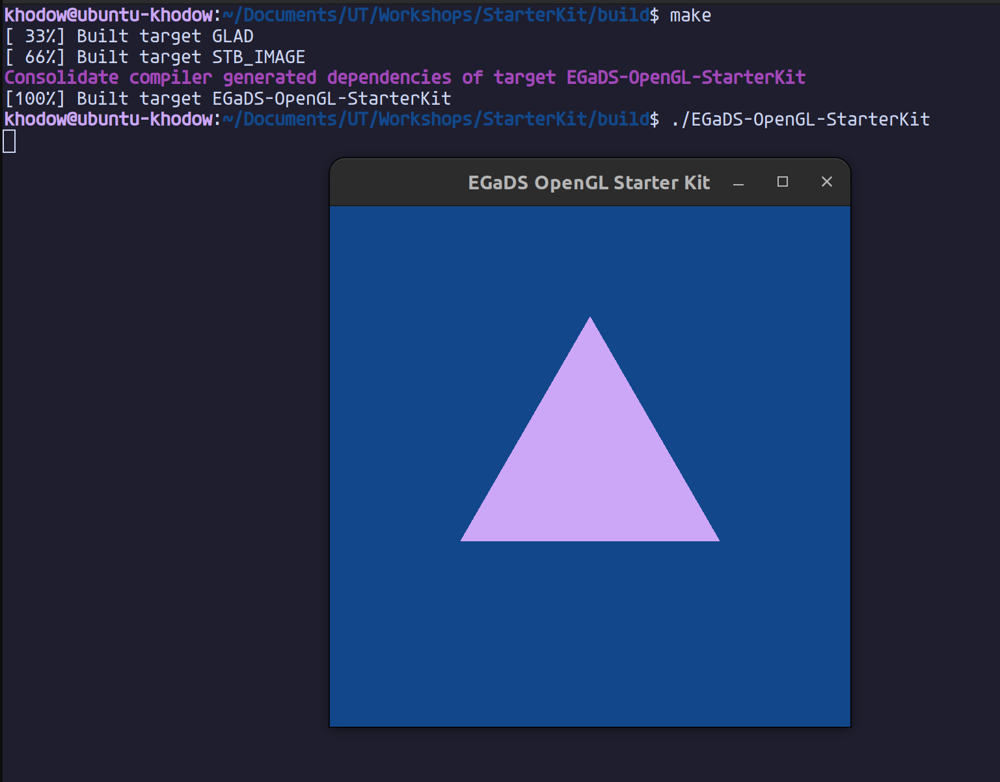
</p>


# Element Buffer Objects (EBOs)

So we are able to draw a triangle now by telling **OpenGL** to use the triangle primitive to draw a triangle between 3 vertices. We can label these vertices `0`, `1`, and `2`. 

<p align="center">
  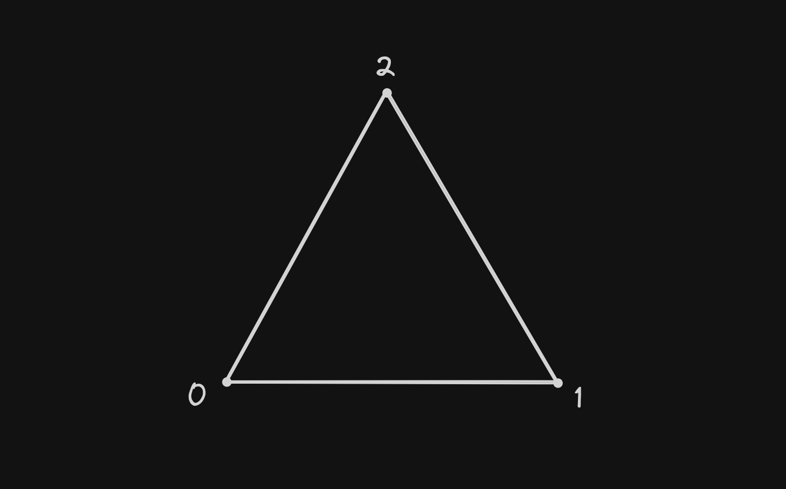
</p>

However, consider a scenario where we would want to now draw 3 separate triangles that share a few vertices. Perhaps, like this.

<p align="center">
  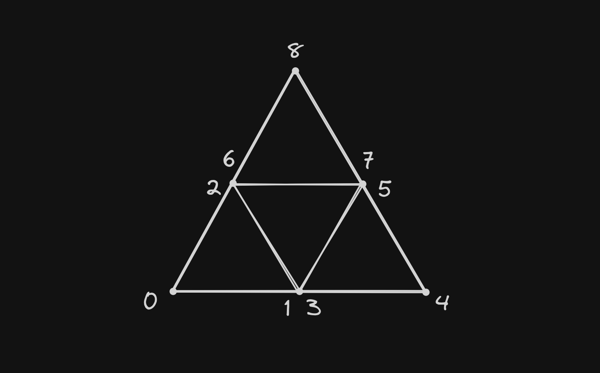
</p>

As you can see, there is an overlap of vertices at the three shared points. This means that in order to upload the necessary information, we would need nine total vertices when in reality, we probably only need six if we could reuse the shared vertices.

<p align="center">
  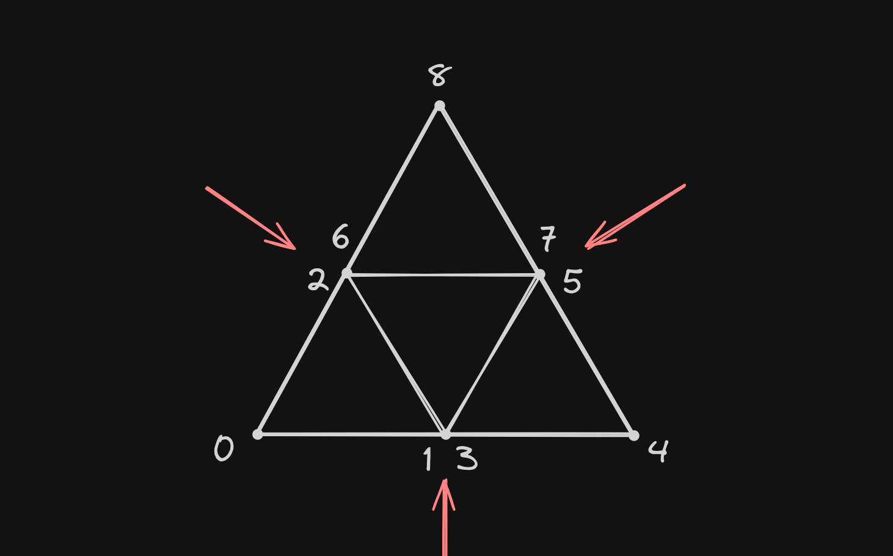
</p>

As a solution, let's only define six vertices, `0` through `5`, as such.

<p align="center">
  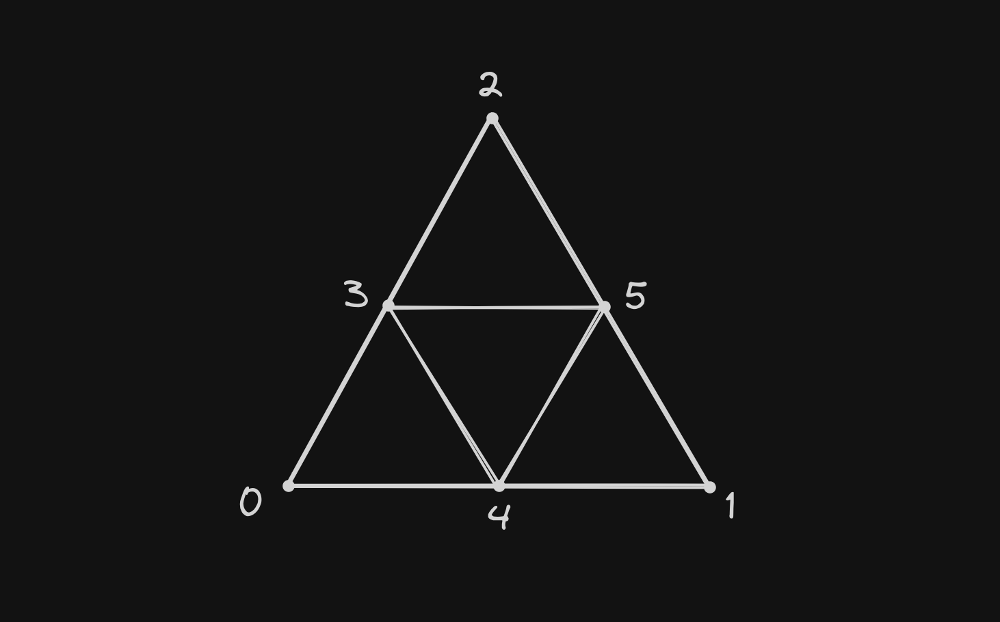
</p>

Then, we can make use of something called an **Element Buffer Object** that we can then use to define the order of these referenced vertices in order the draw the shapes we want. In this case, three triangles.

Therefore, using our numbering system, it would look something like `[0, 4, 3, 4, 1, 5, 3, 5, 2]` to draw 3 triangles with our mapping!

<p align="center">
  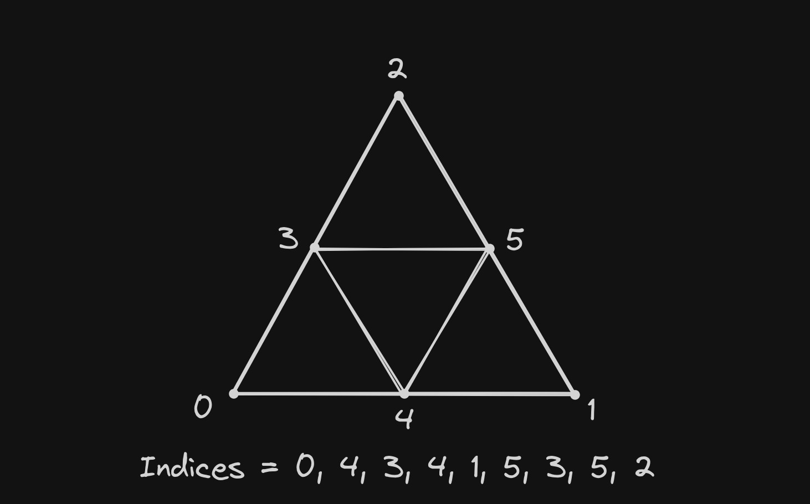
</p>

## Adding New Vertices

Let's jump into our code and start by adding some vertices. I am just going to add some vertices on the midpoints of the triangle we originally had.
```cpp
GLfloat vertices[] = {
	-0.5f, -0.5f * float(sqrt(3)) / 3, 0.0f,
	0.5f, -0.5f * float(sqrt(3)) / 3, 0.0f,
	0.0f, 0.5f * float(sqrt(3)) * 2 / 3, 0.0f, 	
	-0.5f / 2, 0.5f * float(sqrt(3)) / 6, 0.0f, 	
	0.5f / 2, 0.5f * float(sqrt(3)) / 6, 0.0f, 	
	0.0f, -0.5f * float(sqrt(3)) / 3, 0.0f, 	
};
```
Next let's add a `GLuint` array of indices that will map our triangle layout using our given vertices. Note, the numbers will be in a different order than my diagram since this is based on the order from the vertices array above.
```cpp
GLuint indices[] =  {
	0, 3, 5,
	3, 2, 4,
	5, 4, 1,
};
```

Now we can create the **EBO** in a similar fashion to the **VAO** earlier! Let's create its reference value as a `GLuint` and generate its value using `glGenBuffers()`
```cpp
GLuint VAO, VBO, EBO;

glGenVertexArrays(1, &VAO);
glGenBuffers(1, &VBO);
glGenBuffers(1, &EBO);
```

Next, we need to bind the **EBO** using `glBindBuffer()` and the `glBufferData()` methods, but this time with the `GL_ELEMENT_ARRAY_BUFFER` flag instead!
```cpp
glBindBuffer(GL_ELEMENT_ARRAY_BUFFER, EBO);
glBufferData(GL_ELEMENT_ARRAY_BUFFER, sizeof(indices), indices, GL_STATIC_DRAW);
```

Then we can unbind our **EBO** just like the other **buffers**. Make sure to unbind them in the same order that you bind them!
```cpp
glBindBuffer(GL_ARRAY_BUFFER, 0);
glBindVertexArray(0);
glBindBuffer(GL_ELEMENT_ARRAY_BUFFER, 0);
```

And finally, we can delete the **EBO** at the end along with the other **buffer objects**!
```cpp
glDeleteVertexArrays(1, &VAO);
glDeleteBuffers(1, &VBO);
glDeleteBuffers(1, &EBO);
glDeleteProgram(shaderProgram);
```

## Draw Elements

Now, let's draw the elements that we described earlier with our vertices and indices arrays. We can replace the `glDrawArrays()` call with a `glDrawElements()` call. The parameters for `glDrawElements()` are as follows.
- The shape primitive type to draw, which in our case is a triangle, so we will use `GL_TRIANGLES`
- The number of indices
- The data type of the indices, which is `GL_UNSIGNED_INT` in our case
- The starting location of the beginning index for the shape, which is `0` in our case
```cpp
glDrawElements(GL_TRIANGLES, 9, GL_UNSIGNED_INT, 0);
```

Awesome! Now you're done. If you're a bit lost at this point, the final code for `main.cpp` should look like this!
```cpp
#include<iostream>
#include <tgmath.h>
#include "glad/glad.h"
#include "GLFW/glfw3.h"

const char* vertexShaderSource = "#version 330 core\n"
"layout (location = 0) in vec3 aPos;\n"
"void main()\n"
"{\n"
"   gl_Position = vec4(aPos.x, aPos.y, aPos.z, 1.0);\n"
"}\0";

const char* fragmentShaderSource = "#version 330 core\n"
"out vec4 FragColor;\n"
"void main()\n"
"{\n"
"   FragColor = vec4(0.8f, 0.65f, 0.97f, 1.0f);\n"
"}\n\0";

int main(void) {
	glfwInit();

	glfwWindowHint(GLFW_CONTEXT_VERSION_MAJOR, 3);
	glfwWindowHint(GLFW_CONTEXT_VERSION_MINOR, 3);
	glfwWindowHint(GLFW_OPENGL_PROFILE, GLFW_OPENGL_CORE_PROFILE);

	GLFWwindow* window = glfwCreateWindow(800, 800, "EGaDS OpenGL Starter Kit", NULL, NULL);
  	if (window == NULL) {
		std::cout << "Failed to create GLFW window" << std::endl;
		glfwTerminate();
		return -1;
	}
	glfwMakeContextCurrent(window);

	gladLoadGL();
	glViewport(0, 0, 800, 800);

	GLuint vertexShader = glCreateShader(GL_VERTEX_SHADER);
	glShaderSource(vertexShader, 1, &vertexShaderSource, NULL);
	glCompileShader(vertexShader);

	GLuint fragmentShader = glCreateShader(GL_FRAGMENT_SHADER);
	glShaderSource(fragmentShader, 1, &fragmentShaderSource, NULL);
	glCompileShader(fragmentShader);

	GLuint shaderProgram = glCreateProgram();
	glAttachShader(shaderProgram, vertexShader);
	glAttachShader(shaderProgram, fragmentShader);
	glLinkProgram(shaderProgram);

	glDeleteShader(vertexShader);
	glDeleteShader(fragmentShader);

	GLfloat vertices[] = {
		-0.5f, -0.5f * float(sqrt(3)) / 3, 0.0f,
		0.5f, -0.5f * float(sqrt(3)) / 3, 0.0f,
		0.0f, 0.5f * float(sqrt(3)) * 2 / 3, 0.0f, 	
		-0.5f / 2, 0.5f * float(sqrt(3)) / 6, 0.0f, 	
		0.5f / 2, 0.5f * float(sqrt(3)) / 6, 0.0f, 	
		0.0f, -0.5f * float(sqrt(3)) / 3, 0.0f, 	
  	};

  	GLuint indices[] = {
    		0, 3, 5,
    		3, 2, 4,
    		5, 4, 1,
	};

	GLuint VAO, VBO, EBO;

	glGenVertexArrays(1, &VAO);
	glGenBuffers(1, &VBO);
  	glGenBuffers(1, &EBO);

	glBindVertexArray(VAO);

	glBindBuffer(GL_ARRAY_BUFFER, VBO);
	glBufferData(GL_ARRAY_BUFFER, sizeof(vertices), vertices, GL_STATIC_DRAW);
  
 	 glBindBuffer(GL_ELEMENT_ARRAY_BUFFER, EBO);
  	glBufferData(GL_ELEMENT_ARRAY_BUFFER, sizeof(indices), indices, GL_STATIC_DRAW);

  	glVertexAttribPointer(0, 3, GL_FLOAT, GL_FALSE, 3 * sizeof(float), (void*)0);
	glEnableVertexAttribArray(0);

	glBindBuffer(GL_ARRAY_BUFFER, 0);
	glBindVertexArray(0);
  	glBindBuffer(GL_ELEMENT_ARRAY_BUFFER, 0);

	while (!glfwWindowShouldClose(window)) {
		glClearColor(0.07f, 0.28f, 0.55f, 1.0f);
		glClear(GL_COLOR_BUFFER_BIT);
		glUseProgram(shaderProgram);
		glBindVertexArray(VAO);
		glDrawElements(GL_TRIANGLES, 9, GL_UNSIGNED_INT, 0);

		glfwSwapBuffers(window);
		glfwPollEvents();
	}

	glDeleteVertexArrays(1, &VAO);
	glDeleteBuffers(1, &VBO);
 	glDeleteBuffers(1, &EBO);
	glDeleteProgram(shaderProgram);

	glfwDestroyWindow(window);
	glfwTerminate();
	return 0;
}
```

And now we if we build and run, you can see we have 3 separate triangles that have 3 shared vertices! Cool right?

<p align="center">
  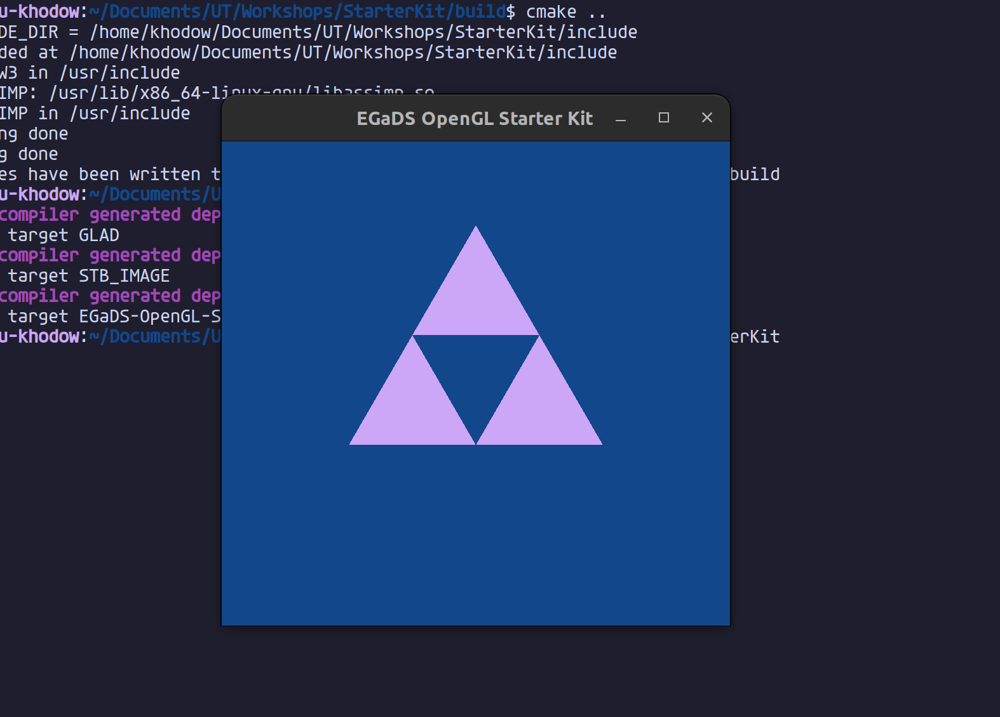
</p>

# Organizing
## Shaders
Now since our `main.cpp` is getting a little long, let's organize some of our functionality into separate files.

First if you have not created it already, create the directory `res/shaders` in the project root directory. Now let's create 2 shader files: `default.vert` and `default.frag`. These are going to be our vertex shader and frament shader respectively!

```glsl
#version 330 core

layout (location = 0) in vec3 aPos;

void main() {
   gl_Position = vec4(aPos.x, aPos.y, aPos.z, 1.0);
}
```

```glsl
#version 330 core

out vec4 FragColor;

void main() {
   FragColor = vec4(0.8f, 0.65f, 0.97f, 1.0f);
}
```

Now, let's create a header file called `shader.h` in our `src` directory. At the top we will write `#pragma once`. This prevents our header file from being included more than once in the current project, as that would be redundant. This is very typical to include at the top of header files.

Additionlly, let's include some libraries that will help use parse the shader files we just created!
```cpp
#pragma once

#include <string>
#include <fstream>
#include <sstream>
#include <iostream>
#include <cerrno>
#include "glad/glad.h"
```

Next we can declare a function that will help us parse the shader files and load them into our shader objects as `strings`.
```cpp
std::string get_file_contents(const char* filename);
```

Now let's declare the shader class that will essentially be our **OpenGL** shader, but wrapped up in a nice object format for ease of use!

We can create a member variable for our shader ID and establish a constructor that will take in the vertex and fragment shader source files. 

We can also declare `Activate()` and `Delete()` functions to bind and unbind the shader in **OpenGL**.
```cpp
class Shader {
public:
	GLuint ID;
	Shader(const char* vertexFile, const char* fragmentFile);

	void Activate();
	void Delete();
};
```

Now let's create `shader.cpp` in our `src` directory! And include the `shader.h` file we just created!
```cpp
#include "shader.h"
```

Then we can define our `get_file_contents()` function that will return the shader source code from the file as a `string`. If you are more curious about this step I would look further into file parsing in **C** and **C++**
```cpp
std::string get_file_contents(const char* filename) {
	std::ifstream in(filename, std::ios::binary);
	if (in) {
		std::string contents;
		in.seekg(0, std::ios::end);
		contents.resize(in.tellg());
		in.seekg(0, std::ios::beg);
		in.read(&contents[0], contents.size());
		in.close();
		return(contents);
	}
	throw(errno);
}
```

Now let's define the constructor for our `Shader` class. This is going to be taking in the two file names and setting them up in **OpenGL**
```cpp
Shader::Shader(const char* vertexFile, const char* fragmentFile) {
	
}
```

Inside this constructor, we can first use our parsing function from earlier and grab our strings from the file as `c_str` or character arrays! 
```cpp
std::string vertexCode = get_file_contents(vertexFile);
std::string fragmentCode = get_file_contents(fragmentFile);

const char* vertexSource = vertexCode.c_str();
const char* fragmentSource = fragmentCode.c_str();
```

From here we can just copy paste what we did in `main.cpp` over and it should be all set up! 
```cpp
Shader::Shader(const char* vertexFile, const char* fragmentFile) {
    std::string vertexCode = get_file_contents(vertexFile);
    std::string fragmentCode = get_file_contents(fragmentFile);

    const char* vertexShaderSource = vertexCode.c_str();
    const char* fragmentShaderSource = fragmentCode.c_str();

    GLuint vertexShader = glCreateShader(GL_VERTEX_SHADER);
    glShaderSource(vertexShader, 1, &vertexShaderSource, NULL);
    glCompileShader(vertexShader);

    GLuint fragmentShader = glCreateShader(GL_FRAGMENT_SHADER);
    glShaderSource(fragmentShader, 1, &fragmentShaderSource, NULL);
    glCompileShader(fragmentShader);

    ID = glCreateProgram();
    glAttachShader(ID, vertexShader);
    glAttachShader(ID, fragmentShader);
    glLinkProgram(ID);

    glDeleteShader(vertexShader);
    glDeleteShader(fragmentShader);
}
```

Now we can also implement `Activate()` and `Delete()`. These will just use **OpenGL**'s `glUseProgram()` and `glDeleteProgram()` respectively!
```cpp
void Shader::Activate() {
  glUseProgram(ID);
}

void Shader::Delete() {
  glDeleteProgram(ID);
}
```
## VBOs
Similarly, let's organize our VBOs! We can create a new header file called `VBO.h` and once again write `#pragma once` and include `glad/glad.h` for **OpenGL** functionality!
```cpp
#pragma once

#include<glad/glad.h>
```

Ok cool! We can now declare our VBO class. This is once again going to have a `GLuint` ID and a constructor. Notice that the size is of the type `GLsizeiptr`. This is the type that is used when creating a VBO, so let's just have the constructor use that!

We also want to provide some useful functionality for the VBO, so let's declare `Bind()`, `Unbind()`, and `Delete()` methods.
```cpp
class VBO {
public:
	GLuint ID;
	VBO(GLfloat* vertices, GLsizeiptr size);

	void Bind();
	void Unbind();
	void Delete();
};
```

Cool we can now create a `VBO.cpp` file and fill in the functionality of the constructor and these methods similar to how we did it in `main.cpp`
```cpp
#include "VBO.h"

VBO::VBO(GLfloat* vertices, GLsizeiptr size) {
	glGenBuffers(1, &ID);
	glBindBuffer(GL_ARRAY_BUFFER, ID);
	glBufferData(GL_ARRAY_BUFFER, size, vertices, GL_STATIC_DRAW);
}

void VBO::Bind() {
	glBindBuffer(GL_ARRAY_BUFFER, ID);
}

void VBO::Unbind() {
	glBindBuffer(GL_ARRAY_BUFFER, 0);
}

void VBO::Delete() {
	glDeleteBuffers(1, &ID);
}
```

## EBOs

Awesome! Now we can do the same thing with EBOs. Create `EBO.h` and `EBO.cpp` files and copy over everything from `VBO.h` and `VBO.cpp`. Now just replace every `VBO` with `EBO` and every `GL_ARRAY_BUFFER` with `GL_ELEMENT_BUFFER` as a flag.
```cpp
#pragma once

#include "glad/glad.h"

class EBO {
public:
	GLuint ID;
	EBO(GLuint* indices, GLsizeiptr size);

	void Bind();
	void Unbind();
	void Delete();
};
```
```cpp
#include "EBO.h"

EBO::EBO(GLuint* indices, GLsizeiptr size) {
	glGenBuffers(1, &ID);
	glBindBuffer(GL_ELEMENT_ARRAY_BUFFER, ID);
	glBufferData(GL_ELEMENT_ARRAY_BUFFER, size, indices, GL_STATIC_DRAW);
}

void EBO::Bind() {
	glBindBuffer(GL_ELEMENT_ARRAY_BUFFER, ID);
}

void EBO::Unbind() {
	glBindBuffer(GL_ELEMENT_ARRAY_BUFFER, 0);
}

void EBO::Delete() {
	glDeleteBuffers(1, &ID);
}
```

## VAOs

Now finally, we can make a vertex array class. Create a `VAO.h` and a `VAO.cpp` file.

In `VAO.h` include **glad** and `VBO.h`. Now we can define our ID and constructor, as well as functionality for linking VBOs to the VAO with a `GLuint` layout ID. 
```cpp
#pragma once

#include "glad/glad.h"
#include "VBO.h"

class VAO {
public:
	GLuint ID;
	VAO();

	void LinkVBO(VBO& VBO, GLuint layout);
	void Bind();
	void Unbind();
	void Delete();
};
```

Cool! Let's implement these! For that all we need to do is copy over some of the VAO functionality from our `main.cpp` file. This time, we can use our **VBO** `Bind()` method though, since we included `VBO.h` in `VAO.h`!
```cpp
#include "VAO.h"

VAO::VAO() {
	glGenVertexArrays(1, &ID);
}

void VAO::LinkVBO(VBO& VBO, GLuint layout) {
	VBO.Bind();
	glVertexAttribPointer(layout, 3, GL_FLOAT, GL_FALSE, 0, (void*)0);
	glEnableVertexAttribArray(layout);
	VBO.Unbind();
}

void VAO::Bind() {
	glBindVertexArray(ID);
}

void VAO::Unbind() {
	glBindVertexArray(0);
}

void VAO::Delete() {
	glDeleteVertexArrays(1, &ID);
}
```

## Cleaning up main.cpp

Nice! We are getting close! All that is left to do is to modify our `main.cpp` file to use all these new abstractions we have created!

The result should look something like this! Look how much cleaner it looks!
```cpp
#include<iostream>
#include <math.h>
#include "glad/glad.h"
#include "GLFW/glfw3.h"

#include "VAO.h"
#include "VBO.h"
#include "EBO.h"
#include "shader.h"

GLfloat vertices[] = {
	-0.5f, -0.5f * float(sqrt(3)) / 3, 0.0f,
  	0.5f, -0.5f * float(sqrt(3)) / 3, 0.0f,
  	0.0f, 0.5f * float(sqrt(3)) * 2 / 3, 0.0f, 	
	-0.5f / 2, 0.5f * float(sqrt(3)) / 6, 0.0f, 	
  	0.5f / 2, 0.5f * float(sqrt(3)) / 6, 0.0f, 	
  	0.0f, -0.5f * float(sqrt(3)) / 3, 0.0f, 	
};

GLuint indices[] = {
  	0, 3, 5,
  	3, 2, 4,
  	5, 4, 1,
};

int main(void) {
	glfwInit();

	glfwWindowHint(GLFW_CONTEXT_VERSION_MAJOR, 3);
	glfwWindowHint(GLFW_CONTEXT_VERSION_MINOR, 3);
	glfwWindowHint(GLFW_OPENGL_PROFILE, GLFW_OPENGL_CORE_PROFILE);

	GLFWwindow* window = glfwCreateWindow(800, 800, "EGaDS OpenGL Starter Kit", NULL, NULL);
	if (window == NULL) {
		std::cout << "Failed to create GLFW window" << std::endl;
		glfwTerminate();
		return -1;
	}
	glfwMakeContextCurrent(window);

	gladLoadGL();
	glViewport(0, 0, 800, 800);

	Shader shaderProgram("res/shaders/default.vert", "res/shaders/default.frag");

  	VAO vao;
  	vao.Bind();

	VBO vbo(vertices, sizeof(vertices));
  	EBO ebo(indices, sizeof(indices));

	vao.LinkVBO(vbo, 0);
	vao.Unbind();
	vbo.Unbind();
	ebo.Unbind();

	while (!glfwWindowShouldClose(window)) {
		glClearColor(0.07f, 0.28f, 0.55f, 1.0f);
		glClear(GL_COLOR_BUFFER_BIT);
		shaderProgram.Activate();
		vao.Bind();
		glDrawElements(GL_TRIANGLES, 9, GL_UNSIGNED_INT, 0);
		glfwSwapBuffers(window);
		glfwPollEvents();
	}

  	vao.Delete();
  	vbo.Delete();
  	ebo.Delete();
  	shaderProgram.Delete();

	glfwDestroyWindow(window);
	glfwTerminate();
	return 0;
}
```

Also when we build and run, it runs just the same!

<p align="center">
  
</p>

# Shaders

Now that that's clean and organized we can move on to some other computer graphics topics. So, let's talk about **shaders**!

You can kind of think of **shaders** as functions on a GPU. They can take inputs and have outputs.

## Vertex Shader
If we take a look at this **vertex shader** source code here, you can actually see that this is **OpenGL**'s shading language, called **GLSL**. It has a syntax that is pretty similar to **C**.
```glsl
#version 330 core

layout (location = 0) in vec3 aPos;

void main() {
   gl_Position = vec4(aPos.x, aPos.y, aPos.z, 1.0);
}
```

The first line indicates the version of OpenGL being used. We are currently using **OpenGL 3.3.0**, so we should use **GLSL** version `330`.
```glsl
#version 330 core
```

The second line takes a vector of three values called `aPos` at location `0`. This location is refering to the location of the vertex data it recieves. As you might remember, we set our vertices at location `0`. We could theoretically store other information like color in the other locations and use them in our **shader**.
```glsl
layout (location = 0) in vec3 aPos;
```

Next we have our main loop with one line. This is what is responsible for performing any calculations and giving us an output. In this code, we simple assign `gl_Position` with our position's `x`, `y`, and `z` values, plus a `1.0` for our fourth dimension. **OpenGL** recognizes `gl_Position` and knows to use it as the vertex position.
```glsl
void main() {
   gl_Position = vec4(aPos.x, aPos.y, aPos.z, 1.0);
}
```
## Fragment Shader
Now in this **fragment shader** you can see that we define an output vector of four values called `FragColor`. A fragment shader must output a `vec4` due to **OpenGL** requiring color information for rendering. In this case, we just pass it our 4 floats and call it a day!
```glsl
#version 330 core

out vec4 FragColor;

void main() {
   FragColor = vec4(0.8f, 0.65f, 0.97f, 1.0f);
}
```

Let's modify our **vertex shader** now to grab both our position and color information!
```glsl
#version 330 core

layout (location = 0) in vec3 aPos;
layout (location = 1) in vec3 aColor;

out vec3 color;

void main() {
	gl_Position = vec4(aPos.x, aPos.y, aPos.z, 1.0);
	color = aColor;
}
```

This grabs the position information from location `0` and the color information from location `1`. Then it will output the color, which we assign in the `main()` function of the **shader**.

Now in our **fragment shader** we can use this output variable `color` from our vertex shader and do what we want with it. Be sure to name your variables with the same name, or it will not be able to find your attributes!
```cpp
#version 330 core

in vec3 color;

out vec4 FragColor;

void main() {
	FragColor = vec4(color, 1.0f);
}
```
What this does is pass our imported color information into the output display as the final color!

## Interleaving Data
Ok! Now we understand a little bit about shaders and what they do, let's talk about a concept called **interleaving data**. This essentially means grouping different pieces of data used for different things in the same array or structure. This prevents us from having to define new **buffer** objects for the same vertices to store different information.

If we go back to `main.cpp` we can demonstrate this! We can add 3 extra values for each vertex, representing the RGB coloring. Feel free to choose whatever values you'd like!
```cpp
GLfloat vertices[] = {
	 -0.5f, -0.5f * float(sqrt(3)) * 1 / 3, 0.0f, 0.8f, 0.3f,  0.02f,
	 0.5f, -0.5f * float(sqrt(3)) * 1 / 3, 0.0f, 0.8f, 0.3f,  0.02f,
	 0.0f,  0.5f * float(sqrt(3)) * 2 / 3, 0.0f, 1.0f, 0.6f,  0.32f,
	 -0.25f, 0.5f * float(sqrt(3)) * 1 / 6, 0.0f, 0.9f, 0.45f, 0.17f,
	 0.25f, 0.5f * float(sqrt(3)) * 1 / 6, 0.0f, 0.9f, 0.45f, 0.17f,
	 0.0f, -0.5f * float(sqrt(3)) * 1 / 3, 0.0f, 0.8f, 0.3f,  0.02f
};
```
Now we have position and color information interspersed in our vertex array. It goes by the format `x1, y1, z1, r1, g1, b1, x2, y2, ...` The distance between a relevant piece of data and the next vertex's information of the same type is called the **stride**, while the distance from position `0` to the first item of the data is called the **offset**. In the diagram below, the offset is three times the size of a float in bytes!

<p align="center">
  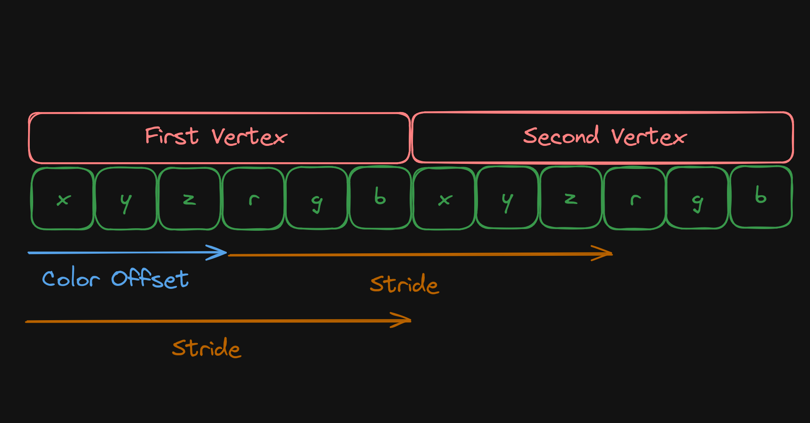
</p>

Now this is cool, but we have no real way to find separate out this information when reading it at the moment. So let's navigate to `VAO.h` and modify the `LinkVBO()` method to support this.

First, let's rename it to something more fitting, like `LinkAttrib()` and add som parameters so we can parse this, specifically `numComponents`, `type`, and `offset`.
```cpp
void LinkAttrib(VBO& VBO, GLuint layout, GLuint numComponents, GLenum type, GLsizeiptr stride, void* offset);
```

Now, if we navigate to `VAO.cpp` we can change the method definition, and pass in our new parameters to `glVertexAttribPointer()`.
```cpp
void VAO::LinkAttrib(VBO& VBO, GLuint layout, GLuint numComponents, GLenum type, GLsizeiptr stride, void* offset) {
	VBO.Bind();
	glVertexAttribPointer(layout, numComponents, type, GL_FALSE, stride, offset);
	glEnableVertexAttribArray(layout);
	VBO.Unbind();
}
```

All there's left to do is to use these new parameters to define our locations!
Let's navigate to `main.cpp` and replace `vao.LinkVBO(vbo, 0)` with:
```cpp
vao.LinkAttrib(vbo, 0, 3, GL_FLOAT, 6 * sizeof(float), (void*)0);
vao.LinkAttrib(vbo, 1, 3, GL_FLOAT, 6 * sizeof(float), (void*)(sizeof(float) * 3));
```

Now, if we compile and run, you will find a nice-looking gradient of our colors from the vertices! Looks beautiful, no?

<p align="center">
  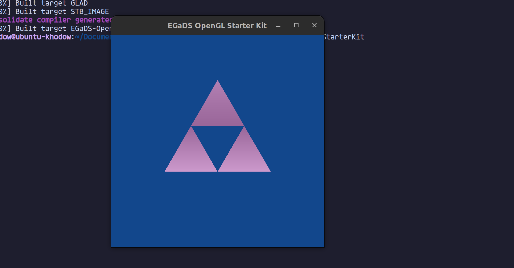
</p>

You might wonder why we get this gradient instead of solid colors like we defined in our indices. This is because **OpenGL** actually interpolates the data between 2 points, giving us a blend between our different RGB values. This doesn't only apply to colors, obviously our position data is being interpolated as well. If we were to define other data that would also be affected in a similar fashion!

## Uniforms
Ok we have one more thing to talk about with **shaders**. A **uniform** is a value that we can pass to a **shader** program in **OpenGL** this way we can modify our shader values and get visual changes in real time!

We can worry about uploading **uniforms** later on, but for now let's define a **uniform** value in our **vertex shader**. For that, we would use the keyword `uniform`. Then, we can use this new **uniform** called `scale` to apply to our `gl_Position` calculation! This will just make our triangles bigger.
```glsl
#version 330 core

layout (location = 0) in vec3 aPos;
layout (location = 1) in vec3 aColor;

out vec3 color;
uniform float scale;

void main() {
	gl_Position = vec4(aPos.x + aPos.x * scale, aPos.y + aPos.y * scale, aPos.z + aPos.z * scale, 1.0);
	color = aColor;
}
```

However, if we compile and run this, you'll notice that we still have the same thing being displayed. This is because the uniform is defaulted to `0`, so we aren't actually adding anything to our position.
<p align="center">
  
</p>

We could assign it a value in the shader itself, but would be more cool to upload that information from our `main.cpp` file so game logic could eventually tweak our shader values!
Let's navigate to `main.cpp` and after we load our information for **VBO**, **VAO**, **EBO**, and **shaderProgram** we can assign a `GLuint` with the location of our uniform variable on the GPU. **OpenGL** has a very useful function for this called `glGetUniformLocation()`
```cpp
GLuint scaleID = glGetUniformLocation(shaderProgram.ID, "scale");
```

Now that we have the location of this uniform, after calling `Activate()` on the shader, let's set the uniform value to something and check if our triangle looks different! What we are doing with `glUniformif()` is uploading one float value to the uniform location at `scaleID`. This is how we modify our shader values!
```cpp
glUniform1f(scaleID, 0.5f);
```

If we run this you will find that our triangles are now slightly bigger, and this was all controlled from our `main.cpp` file!

<p align="center">
  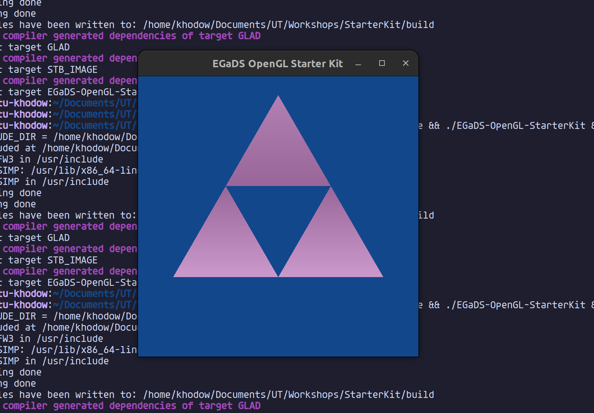
</p>
