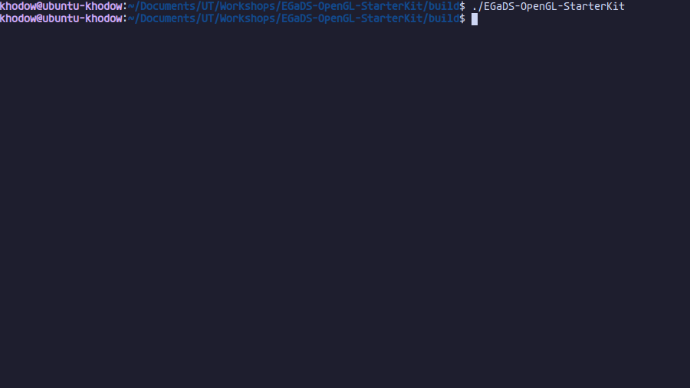

# EGaDS! Super Simple OpenGL CMake Kit

Hey everyone! This is going to be a very simple way of setting up a basic 3D application using **C++** and **OpenGL**. This should give you a quick start in basic computer graphics concepts and allow you to start making cool games/projects using these concepts!

# Installation & Setup

In this step we're going to set up the project so we can start working.

Start by cloning this repository using the below command and follow the instructions below!

```
git clone https://github.com/texas-egads/EGaDS-OpenGL-StarterKit.git
```
> **Note:** Support for **Mac** builds is coming soon, for now it is not supported.

## For Linux
Make sure your system has the **necessary drivers** for your graphics card. Installation instructions for those depend on your distribution. Also make sure you have a **C/C++ compiler**. You can verify this by doing a check to see if you can see the compiler information.
```
g++ --version
```
Next you want to install some **dependencies** on your system, use the below commands to install those third-party libraries!
```
sudo apt update
sudo apt install -y build-essential cmake mesa-common-dev mesa-utils freeglut3-dev libassimp-dev
```
Now navigate to the local repository's main project folder and run these commands to **build** and **run** the project.
```
  mkdir build
  cd build
  cmake ..
  make -j4
  ./EGaDS-OpenGL-StarterKit
```
The last command should do nothing since the **main.cpp** file in the template just returns 0. So you are good to go!

## For Windows
### Visual Studio
- **Install Visual Studio**: If you haven't already, download and install Visual Studio from the [official website](https://visualstudio.microsoft.com/).

- **Install CMake support**: During the installation of Visual Studio, make sure to select the workload "Desktop development with C++", which includes CMake support. If you've already installed Visual Studio without this workload, you can modify your installation by running the Visual Studio Installer again and adding the workload.

- **Open your project folder in Visual Studio**: Open Visual Studio and either create a new project or open an existing one where your CMakeLists.txt file resides. You can do this by selecting "Open a project or solution" from the Visual Studio start page or by going to the "File" menu and choosing "Open" > "Folder...".

- **Configure CMake settings**: Once your project is open in Visual Studio, go to the "CMake" menu and choose "Change CMake Settings". This will create or open a CMakeSettings.json file where you can configure your CMake project settings. Make sure to set the "cmakeExecutable" to the path of your CMake executable if it's not automatically detected.

- **Configure your build target**: In the CMakeSettings.json file, specify the configuration you want to build (e.g., Debug or Release) and the architecture (e.g., x64 or x86).

- **Build your project**: After configuring CMake settings, you can build your project by going to the "Build" menu and selecting "Build All" (or pressing `Ctrl+Shift+B`). Visual Studio will generate the build files using CMake and build your project according to the specified settings.

- **Run and debug your project**: Once the build is complete, you can run and debug your project directly from Visual Studio using the built-in debugger. Set breakpoints in your code, choose the desired startup configuration (e.g., executable), and start debugging by pressing `F5` or clicking the "Start Debugging" button.

### Visual Studio Code
- **Install Visual Studio Code**: If you haven't already, download and install Visual Studio Code from its [official website](https://code.visualstudio.com/).

- **Install CMake Tools extension**: Open Visual Studio Code, go to the Extensions view by clicking on the square icon on the sidebar or pressing `Ctrl+Shift+X`, then search for "CMake Tools" and install it.

- **Open your project folder in Visual Studio Code**: Open Visual Studio Code and either create a new folder for your project or open an existing one where your CMakeLists.txt file resides.

- **Install C++ extension (optional)**: If you haven't already, you might want to install the C++ extension for Visual Studio Code to get C++ language support. You can find it in the Extensions view as well.

- **Configure CMake Tools**: Once you have your project open in Visual Studio Code, press `Ctrl+Shift+P` to open the command palette, type "CMake: Quick Start" and select it. Follow the prompts to set up your project. You'll need to specify the source directory (where your CMakeLists.txt is located) and the build directory (where your build files will be generated).

- **Build your project**: After configuring CMake Tools, you should see the CMake extension appear in the bottom status bar. Click on it and select "Configure" to configure your project, then select "Build" to build it.

Cool! Now you should fully be able to build and run your application! At it's current state it should do nothing since all it does is return `0` in **main.cpp**

<p align="center">
  
</p>

# Creating a Window

Now that we have our project ready to go, let's start by creating a window. For that, we will be using the **GLFW** library.

## Setting up GLFW
We can first start by including **GLFW** at the top of our **main.cpp** file and let's include **iostream** as well!
```cpp
#include <iostream>
#include "GLFW/glfw3.h"
```
For those unfamiliar with C++ include formatting, 
- `#include <filename>` makes the preprocessor search in an implementation-defined manner, normally in directories predefined by the compiler. It's usually used for items that are in the standard library and other header files associated with the target platform. 
- `#include "filename"` also makes the preprocessor search in an implementation-defined manner, but it is normally used to include our own header files and third-party libraries. Which in this case, is **GLFW**

Once that's settled, the first thing we need to do is initialize **GLFW** so we can properly use its functionality! 
```cpp
glfwInit();
```
So how **GLFW** works is it creates an **OpenGL** context, but we need to provide it with some information. This done using **Window Hints**. Let's give it some!
```cpp
glfwWindowHint(GLFW_CONTEXT_VERSION_MAJOR, 3);
glfwWindowHint(GLFW_CONTEXT_VERSION_MINOR, 3);
glfwWindowHint(GLFW_OPENGL_PROFILE, GLFW_OPENGL_CORE_PROFILE);
```
What we are doing here is providing the version of our **GLFW** context and specifying our **OpenGL** context. From here let's create a **GLFWwindow*** pointer for our window!
```cpp
GLFWwindow* window = glfwCreateWindow(800, 800, "EGaDS OpenGL Starter Kit", NULL, NULL);
```
`glfwCreateWindow()` Takes in several parameters that define your typical application window. You might be familiar with some of these settings in your everyday use of desktop applications!
- **Width**: This specifies the width of the window in pixels.

- **Height**: This specifies the height of the window in pixels.

- **Title**: This specifies the title of the window, displayed in its title bar.

- **Monitor**: This specifies the monitor to use for full-screen mode. You can pass a pointer to the desired monitor. If you are creating a windowed mode window, pass `NULL`.

- **Share**: This specifies the context to share resources with. You can pass the context of another window if you are sharing resources. For our purposes, this isn't important, so we pass `NULL`.

After this, we can add a bit of error logging and just print a little message to tell us if something goes wrong when creating the window. If that does happen, we can terminate **GLFW**.
```cpp
if (window == NULL) {
	std::cout << "Error creating window" << std::endl;
	glfwTerminate();
}
```

Now, in order to actually use the window we just created, we can use `glfwMakeContextCurrent()` and pass in our **GLFWwindow** pointer. This introduces the window object to the current context in **OpenGL**
```cpp
glfwMakeContextCurrent(window);
```

Then at the end of our application, we can destroy our window and terminate **GLFW**. This just cleans things up!
```cpp
glfwDestroyWindow(window);
glfwTerminate();
```
Now your **main.cpp** file should look something like this!
```cpp
#include<iostream>
#include<GLFW/glfw3.h>

int main(void) {
	glfwInit();

	glfwWindowHint(GLFW_CONTEXT_VERSION_MAJOR, 3);
	glfwWindowHint(GLFW_CONTEXT_VERSION_MINOR, 3);
	glfwWindowHint(GLFW_OPENGL_PROFILE, GLFW_OPENGL_CORE_PROFILE);

	GLFWwindow* window = glfwCreateWindow(800, 800, "EGaDS OpenGL Starter Kit", NULL, NULL);
	if (window == NULL) {
		std::cout << "Error creating window" << std::endl;
		glfwTerminate();
	}
	
	glfwMakeContextCurrent(window);

	glfwDestroyWindow(window);
	glfwTerminate();
	return 0;
}
```

Let's run our first window! If you have really good eyes, you might notice a window pop up for just a fraction of a second and immediately disappear! This is expected, so don't worry!

<p align="center">
  
</p>

The reason this happens is because as soon as the window is created. We destroy it and terminate the program. This is why we will need a loop to keep our window open and running!
